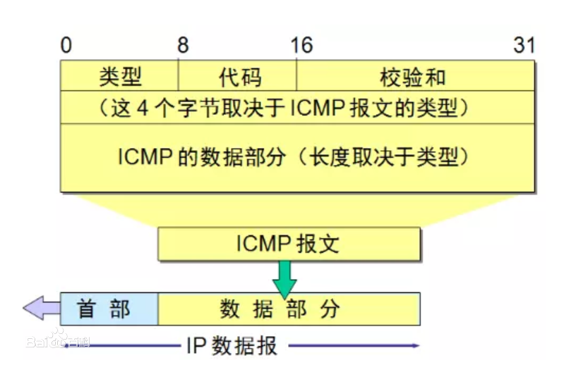

# 计算机网络课程设计ping

## ip数据报首部


```cpp
//IP报头
typedef struct
{
	unsigned char hdr_len : 4;         //4位头部长度
	unsigned char version : 4;         //4位版本号
	unsigned char tos;               //8位服务类型
	unsigned short total_len;        //16位总长度
	unsigned short identifier;       //16位标识符
	unsigned short frag_and_flags;   //3位标志加13位片偏移
	unsigned char ttl;               //8位生存时间
	unsigned char protocol;          //8位上层协议号
	unsigned short checksum;         //16位效验和
	unsigned long sourceIP;          //32位源IP地址
	unsigned long destIP;            //32位目的IP地址
}IP_HEADER;
```


## icmp数据报首部


```cpp
//ICMP报头
typedef struct
{
	BYTE type;     //8位类型字段
	BYTE code;     //8位代码字段
	unsigned short cksum;  //16位效验和
	unsigned short id;     //16位标识符
	unsigned short seq;    //16位序列号
}ICMP_HEADER;
```

## 计算校验和过程

1. 以 *0* 为校验和封装一个用于计算的 **伪报文** ；
2. 将报文分成两个字节一组，如果总字节数为奇数，则在末尾追加一个零字节；
3. 对所有 **双字节** 进行按位求和；
4. 将高于 *16* 位的进位取出相加，直到没有进位；
5. 将校验和按位取反；

```cpp
unsigned short cal_chksum(unsigned short *addr, int len) //ICMP检查算法
i{
    int nleft = len;
    int sum = 0;
    unsigned short *w = addr;
    unsigned short answer = 0;
    while (nleft > 1)
    {
        sum += *w++;
        nleft -= 2;
    }
    if (nleft == 1)
    {
        *(unsigned char *)(&answer) = *(unsigned char *)w;
        sum += answer;
    }
    sum = (sum >> 16) + (sum & 0xffff);
    sum += (sum >> 16);
    answer = ~sum;
    return answer;
}
```

## 封装icmp包

封装icmp包实际上为初始化一个icmp结构体，然后给icmp的各个属性赋值

```cpp
int pack(int pack_no) //封装ICMP包
{
    int packsize;
    struct icmp* icmp;

    packsize = 8 + SEND_SIZE;
    icmp = (struct icmp*)sendpacket;
    icmp->icmp_type = ICMP_ECHO;
    icmp->icmp_code = 0;
    icmp->icmp_chksum = 0;
    icmp->icmp_seq = pack_no; //发送的数据报编号
    icmp->icmp_id = pid;
    icmp->icmp_data = GetTickCount();                                 //记录发送时间
    icmp->icmp_chksum = cal_chksum((unsigned short*)icmp, packsize); //校验算法
    return packsize;
}
```


## 解析ip数据包



由于我们接收的数据是ip数据报，因此如果要获取icmp报文，就需要将ip数据报的首部去除。去除的方法为计算出ip数据的头部，然后使指向ip数据报的指针后移ip首部长度即可得到icmp报文。

首部长度计算：首部长度单位是4B，因此
$$
首部长度=ip报头长度标志*4
$$


```cpp
int unpack(char* buf, int len) //解析IP包
{
    struct ip* ip;
    struct icmp* icmp;
    double rtt;
    int iphdrlen;

    ip = (struct ip*)buf;
    iphdrlen = ip->ip_hl * 4;               /*求ip报头长度,即ip报头的长度标志乘4*/
    icmp = (struct icmp*)(buf + iphdrlen); /*越过ip报头,指向ICMP报头*/
    /*确保所接收的是我所发的的ICMP的回应*/

    if ((icmp->icmp_type == ICMP_ECHOREPLY) && (icmp->icmp_id == pid))
    {
        len = len - iphdrlen - 8;
        rtt = GetTickCount() - icmp->icmp_data;
        cout << "Reply from " << inet_ntoa(from_addr.sin_addr) << ": bytes=" << len << " time=" << rtt << "ms TTL= " << fabs((double)ip->ip_ttl)
            << endl;
        return 1;
    }
    return 0;
}
```


### 计算过程

我们按照两字节的大小对报文进行求和，最后将前十六位和后十六位相加。

为了方便演示，我们假设按4比特来进行相加。
$$
\ \ \ \  1111\\
\ \ \ \  1001\\
\ \ \ \  1110\\
\ \ \ \  0111\\
\ \ \ \  1111\\
\ \ \ \  1110\\
+\ \ 0111\\
-------\\
01010001
$$
我们分成高四位和低四位。

高四位为0101

低四位为0001
$$
\ \ \ 0101\\
+0001\\
-----\\
0110
$$
在程序中，我们还得进行一次高四位加低四位，为了防止此相加结果的高四位仍不为0。但此结果为0110，即高四位为0，低四位为0110，高四位和低四位相加仍为低四位，因此，最终结果为0110。最后，我们将结果取反，得到校验和，即(0110)'=(1001)

## 发送和接收

发送主要用到函数sendto()
其中，第一个参数为 **套接字** ； 第二、三个参数为封装好的 ICMP **报文** 及 **长度** ； 第四、五个参数为 **目的地址** 及地址结构体长度。

接收主要用到函数recvfrom()

```cpp
void sendPacket() //发送ICMP包
{
    int packetsize; //设置icmp报头
    static int pack_no = 0;
    packetsize = pack(pack_no++);

    //发送数据报
    if (sendto(sockfd, sendpacket, packetsize, 0, (struct sockaddr*)&dest_addr, sizeof(dest_addr)) < 0)
        cout << "Destination host unreachable." << endl;
}

void recvPacket() //接收IP包
{
    int n, fromlen;
    int success;

    fromlen = sizeof(from_addr);
    do
    {
        if ((n = recvfrom(sockfd, recvpacket, sizeof(recvpacket), 0, (struct sockaddr*)&from_addr, &fromlen)) >= 0)
            success = unpack(recvpacket, n); //剥去ICMP报头
        else if (WSAGetLastError() == WSAETIMEDOUT)
        {
            cout << "Request timed out." << endl;
            return;
        }
    } while (!success);
}
```


## ping流程图

