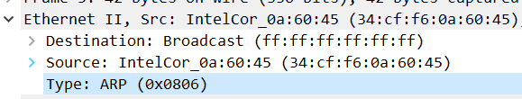
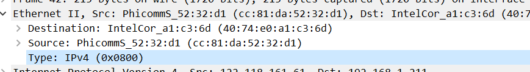

当应用程序通过协议栈向网络传送数据时，应用层的数据报要一次传递给运输。

### inetheader.h

ARP首部
硬件类型：表示硬件地址的类型，值为1表示以太网地址
协议类型：表示要映射的协议地址类型。它的值为0x0800表示IP地址类型
硬件地址长度和协议地址长度以字节为单位，对于以太网上的IP地址的ARP请求或应答来说，他们的值分别为6和4
操作类型,在报文中占2个字节,1表示ARP请求,2表示ARP应答,3表示RARP请求,4表示RARP应答
发送端MAC地址：发送方设备的硬件地址；
发送端IP地址：发送方设备的IP地址；
目标MAC地址：接收方设备的硬件地址。
目标IP地址：接收方设备的IP地址。

**了解混杂模式**

工作在混杂模式下的网卡接收所有的流过网卡的帧，信包捕获程序就是在这种模式下运行的。一般的网络分析工具，都是通过把网卡设置为混杂模式来获取底层数据流。