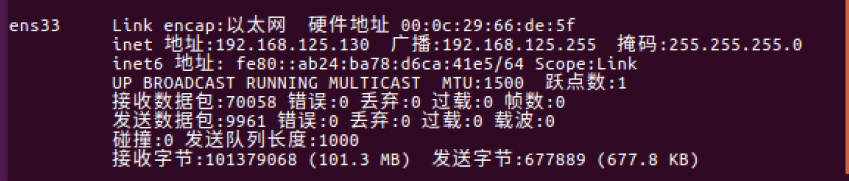
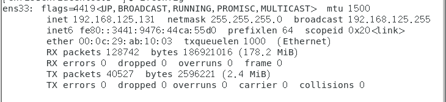

# 实验三

```shell
rawsocket usage:  [-h]  --help information
            	  [-s]  --Source IP Address
            	  [-d]  --Destination IP Address
            	  [-a]  --Capture ARP packets
            	  [-t]  --Capture TCP packets
            	  [-u]  --Capture UDP packets
            	  [-i]  --Capture ICMP packets
```

我们采用运行多个虚拟机来模拟局域网环境

例如Ubuntu的地址为



Centos的地址为



### 截获ICMP包

首先，我们在Centos上运行程序

```shell
./main -i
```

然后我们在Ubuntu上ping发送ICMP包

```shell
ping www.csdn.com
```

接收到的数据如下


### 截获UDP包

首先在Centos上运行程序

```shell
./main -u
```

然后在Ubuntu上打开浏览器浏览网页


### 截获TCP包

首先在Centos上运行程序

```shell
./main -t
```


然后再Ubuntu上发送tcp包

```shell
sudo hping3 -i ens33 -a 192.168.125.1 -S 192.168.125.130 -p 80 -i u10000
```


### 截获ARP包

首先在Centos上运行

```shell
./main -a
```

然后在Ubuntu上发送ARP包

```shell
sudo arpspoof -i ens33 -t 192.168.125.1 192.168.125.130
```

